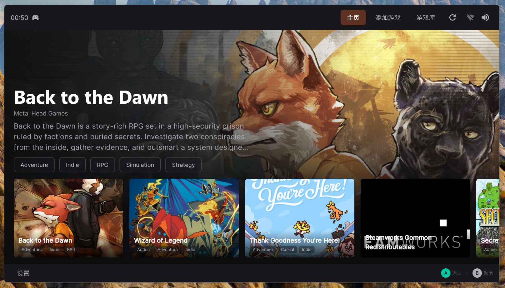

# Squirrel Play 🐿️🎮

> 专为电视与沙发游戏场景打造的桌面游戏库管理器

Squirrel Play 是一款受 Steam 大屏幕模式启发的桌面应用，让你坐在沙发上、用手柄就能管理整个 PC 游戏库。告别鼠标键盘，享受纯粹的大屏游戏体验。



## ✨ 核心功能

### 🎯 大屏沉浸式体验
- **全屏影院级界面**：深色主题搭配动态游戏背景，完美适配电视与显示器
- **自适应布局**：窗口大小变化时自动调整排版，从笔记本到 4K 电视都能舒适使用

### 🎮 手柄即插即玩
- **全程手柄操控**：所有界面均可通过游戏手柄完成，无需碰鼠标
- **直观按键提示**：界面底部实时显示当前可用的手柄操作（确认、返回等）
- **A 确认 / B 返回**：符合主机玩家直觉的交互逻辑

### 🗂️ 智能游戏库管理
- **自动扫描游戏**：添加游戏目录后自动识别可执行文件
- **自动匹配 metadata**：从 RAWG 数据库自动获取游戏封面、简介、类型
- **Steam 集成**：自动识别本地 Steam 游戏并同步官方名称
- **收藏与分类**：把常玩的游戏收藏置顶，快速找到想玩的作品

### ⚡ 快捷操作
- **一键添加**：手动选择游戏执行文件，或批量扫描整個文件夹
- **快速启动**：选中游戏封面按确认键即可启动
- **系统快捷操作**：在设置中可一键锁屏、睡眠、重启或关机

### 🌐 双语支持
- 支持 **简体中文** 与 **英文** 界面，随时在设置中切换

## 🖥️ 系统要求

| 平台 | 最低要求 |
|------|---------|
| Linux | GTK3, x64 |
| Windows | Windows 10/11, x64 |
| macOS | macOS 11+ |

> 💡 **推荐**：连接电视或大屏显示器，配合手柄使用，体验最佳。

## 📦 安装

### 方式一：下载预编译版本（推荐）

前往 [Releases](https://github.com/simiooo/squirrel_play/releases) 页面下载对应系统的安装包：

- **Linux**：`squirrel-play-linux-x64.tar.gz`
- **Windows**：`SquirrelPlay-Setup.exe`
- **macOS**：`SquirrelPlay.dmg`

### 方式二：从源码运行

如果你熟悉 Flutter 开发环境，也可以从源码运行：

```bash
git clone https://github.com/simiooo/squirrel_play.git
cd squirrel_play
flutter pub get
flutter run -d linux   # 或 windows / macos
```

## 🚀 使用指南

### 首次启动

1. 打开应用后，你会看到主界面。初始状态游戏库为空。
2. 点击顶部栏的 **"添加游戏"**，或按手柄对应按键。

### 添加游戏

- **手动添加**：选择游戏的 `.exe`（Windows）或可执行文件，应用会自动识别并尝试匹配封面。
- **扫描目录**：选择一个存放游戏的文件夹（如 `steamapps/common`），应用会自动批量导入。

### 浏览与启动

- 使用 **方向键** 在游戏封面间移动
- 按 **A / 确认键** 启动选中的游戏
- 按 **B / 取消键** 返回上一级
- 主界面顶部可切换 **主页** 与 **游戏库** 视图

### 系统设置

点击左下角 **"设置"** 进入设置页面：

- **语言**：切换 中文 / English
- **音量**：调节系统音量或静音
- **全屏**：开关全屏模式
- **关于本机**：查看设备系统信息
- **托盘菜单**：最小化到系统托盘后，右键托盘图标可快速 **打开 / 隐藏 / 退出**
- **双击托盘图标**：快速显示或隐藏窗口

## 🎮 手柄按键说明

| 按键 | 功能 |
|------|------|
| 方向键 / 左摇杆 | 移动焦点 |
| A / 确认键 | 确认 / 启动游戏 |
| B / 取消键 | 返回 / 关闭弹窗 |
| Start | 全屏切换 |

## 📄 开源协议

本项目基于 MIT 协议开源。

---

> **提示**：Squirrel Play 目前处于积极开发阶段，如果你遇到任何问题或有功能建议，欢迎提交 Issue 或 PR！
